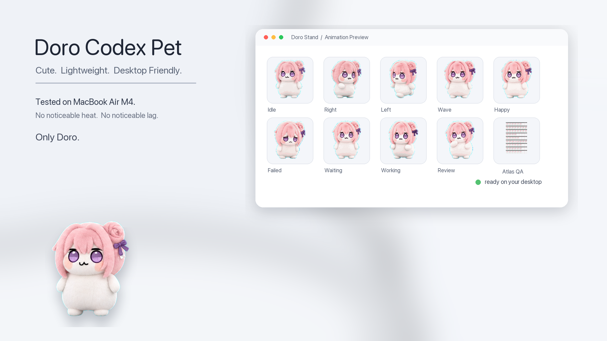
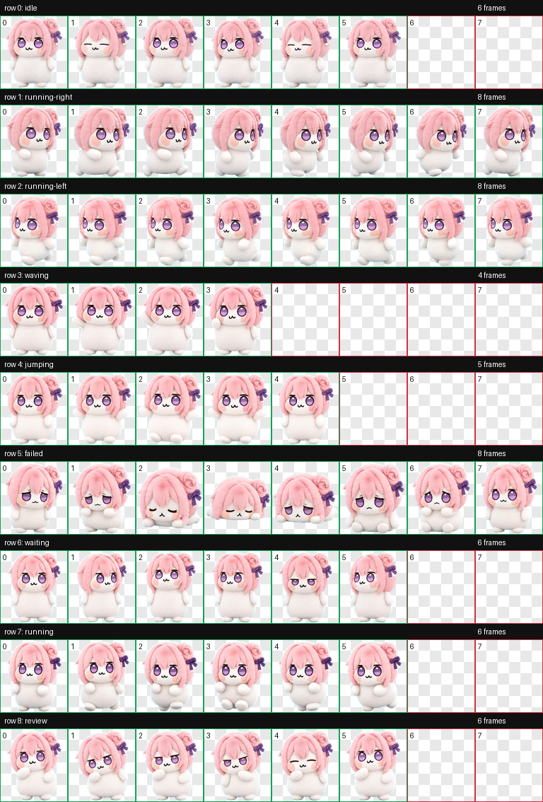

# Doro Codex Pet

A lightweight custom desktop pet package for Codex, featuring a soft Doro-inspired plush mascot with nine animation states.



## Live Demo

GitHub Pages URL: `https://<your-github-username>.github.io/Doro-Codex-Pet/`

## Features

- Cute plush-style Doro desktop mascot
- Nine Codex animation states
- Lightweight WebP spritesheet
- No backend or build step
- Static showcase page that works locally and on GitHub Pages
- Simple two-file Codex pet installation

## How To Use

Choose one of these options:

### Option 1: Preview In Browser

1. Download the repository as a ZIP file.
2. Extract the ZIP file.
3. Open `index.html` in a browser.

### Option 2: Install As A Codex Pet

1. Copy these files:

   ```text
   pet.json
   spritesheet.webp
   ```

2. Paste them into:

   ```text
   ~/.codex/pets/doro-codex-pet/
   ```

3. Restart Codex.
4. Select the custom pet in Codex desktop.

## GitHub Pages

In the repository settings, open **Pages**, choose **Deploy from a branch**,
select the default branch, and publish from the repository root (`/`).

After GitHub Pages is enabled, visit:

```text
https://<your-github-username>.github.io/Doro-Codex-Pet/
```

## Animation States

| Row | State | Purpose |
| --- | --- | --- |
| 1 | `idle` | Calm breathing and blinking |
| 2 | `running-right` | Rightward movement |
| 3 | `running-left` | Leftward movement |
| 4 | `waving` | Greeting |
| 5 | `jumping` | Happy completion |
| 6 | `failed` | Failure reaction |
| 7 | `waiting` | Waiting for user input |
| 8 | `running` | Active work |
| 9 | `review` | Review and verification |



## Tech Stack

- HTML
- CSS
- JavaScript
- WebP and PNG assets

No framework, package manager, backend, or build process is required.

## Project Structure

```text
Doro-Codex-Pet/
├── README.md
├── LICENSE
├── .gitignore
├── index.html
├── pet.json
├── spritesheet.webp
├── assets/
│   └── screenshots/
│       ├── preview.png
│       └── contact-sheet.png
├── css/
│   └── style.css
└── js/
    └── main.js
```

## Future Roadmap

- Add more optional Doro variants
- Add a short installation GIF
- Add community screenshots

## License

Released under the [MIT License](./LICENSE).
